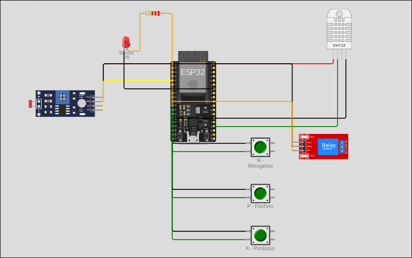
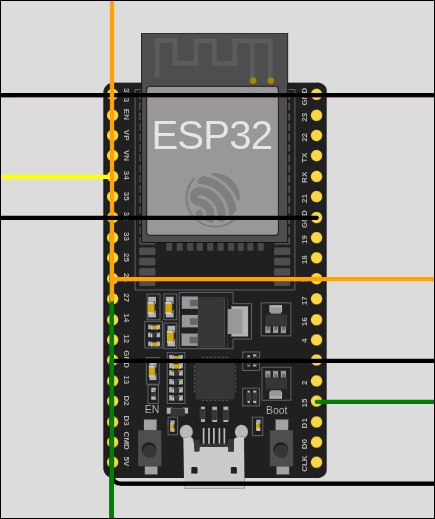
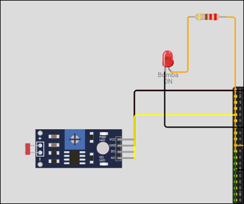
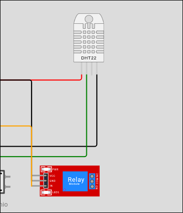
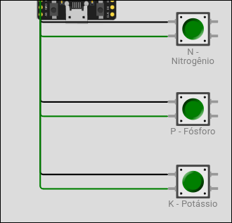

# FIAP - Faculdade de Informática e Administração Paulista

<p align="center">
<a href="https://www.fiap.com.br/"></a>
</p>

<br>

# FarmTech Solutions - Sistema de Irrigacao Inteligente

## Capitulo 1 - Fase 2

## Integrantes:

- <a href="https://www.linkedin.com/in/joão-pedro-zavanela-andreu-119663250/">João Pedro Zavanela Andreu - RM570231</a>
- <a href="https://www.linkedin.com/in/jessicapmgomes/">Jéssica Paula Miranda Gomes - RM572120</a>
- <a href="https://www.linkedin.com/in/caike-minhano/">Caike Minhano - RM569255</a>
- Rafael Briani Rodrigues da Costa - RM573086
- Renan Lucas Seni de Souza - RM570862

## Professores:

### Tutor(a)

- Sabrina Otoni

### Coordenador(a)

- André Godoi

## Descricao

Video demonstrativo: https://www.youtube.com/watch?v=SrPnKHy3MwA

O projeto **FarmTech Solutions - Fase 2** e um sistema de irrigacao inteligente desenvolvido para a disciplina da FIAP. O sistema utiliza um **ESP32** simulado na plataforma **Wokwi** para monitorar sensores agricolas e controlar automaticamente uma bomba d'agua (rele), otimizando a irrigacao de uma lavoura de **Milho**.

Alem do controle baseado em sensores locais, o projeto integra dados meteorologicos da API publica **Open-Meteo** (open-meteo.com) atraves de um script Python, permitindo que a decisao de irrigar leve em conta a previsao de chuva das proximas horas — economizando agua quando a chuva natural for suficiente. A escolha dessa API foi motivada pelo fato de ser gratuita, totalmente publica e **nao exigir cadastro ou API key**, simplificando a reproducao do projeto.

No arquivos LINKS.md temos os links para o video e repositorio do github.

### Sensores utilizados (simulados no Wokwi)

| Sensor Real | Simulacao no Wokwi | Pino ESP32 | Funcao |
|---|---|---|---|
| Nitrogenio (N) | Botao verde | GPIO 32 | Presenca do nutriente (pressionado = presente) |
| Fosforo (P) | Botao verde | GPIO 33 | Presenca do nutriente (pressionado = presente) |
| Potassio (K) | Botao verde | GPIO 25 | Presenca do nutriente (pressionado = presente) |
| Sensor de pH | LDR (sensor de luz) | GPIO 34 (ADC) | Leitura analogica convertida para escala 0-14 |
| Umidade do solo | DHT22 | GPIO 15 | Leitura de umidade (%) |
| Bomba d'agua | Rele azul | GPIO 26 | Liga/desliga irrigacao |
| Indicador visual | LED vermelho | GPIO 27 | Acende quando a bomba esta ligada |

### Logica de irrigacao

A cultura de referencia escolhida foi o **Milho (Zea mays)**, com os seguintes parametros ideais:

- **pH do solo:** 5.5 a 6.8 (levemente acido)
- **Umidade do solo:** 60% a 80%
- **NPK:** Nitrogenio e obrigatorio (nutriente critico para o milho), alem de pelo menos mais um entre Fosforo ou Potassio

A bomba e **LIGADA** somente quando **todas** as condicoes abaixo forem satisfeitas simultaneamente:

1. **Umidade do solo < 60%** → solo seco, irrigacao necessaria
2. **pH entre 5.5 e 6.8** → faixa saudavel para a cultura do milho
3. **Nitrogenio presente** → nutriente obrigatorio para o milho
4. **Pelo menos 2 dos 3 nutrientes NPK presentes** → garante condicoes minimas de fertilidade
5. **Previsao meteorologica permite** → ver tabela abaixo

A bomba e **DESLIGADA** em qualquer um dos casos:

- **Umidade ≥ 80%** → solo ja irrigado o suficiente (evita encharcamento)
- **pH fora da faixa (< 5.5 ou > 6.8)** → irrigar nao resolve desequilibrio quimico
- **Nitrogenio ausente** → sem N, irrigar nao traz beneficio nutricional
- **Menos de 2 nutrientes presentes** → condicoes nutricionais insuficientes
- **Previsao de chuva forte** (nivel 3) → economia de agua
- **Previsao de chuva moderada** (nivel 2) com umidade ≥ 40%

A faixa entre 60% e 80% de umidade funciona como uma **histerese**, evitando que a bomba fique oscilando (liga/desliga repetidamente) em valores de fronteira.

### Integracao com API meteorologica (Open-Meteo)

O sistema integra dados reais da API publica **Open-Meteo** via script Python (`iralem.py`). A Open-Meteo e uma API aberta, gratuita e sem necessidade de API key — basta executar o script. Ele consulta a previsao horaria das proximas 24 horas para as coordenadas configuradas e converte os dados em um **nivel de chuva** discreto (0 a 3) que o ESP32 usa em sua logica de decisao.

Como o plano gratuito do Wokwi nao permite requisicoes HTTP diretas do ESP32, a integracao e feita de forma **manual**: o script Python imprime no terminal um bloco de codigo C++ pronto para ser copiado e colado no `sketch.ino`, substituindo a constante `NIVEL_CHUVA_PREVISTO`.

| Nivel | Condicao meteorologica | Impacto na irrigacao |
|---|---|---|
| 0 | Sem chuva prevista | Irrigacao normal (sem ajuste) |
| 1 | Chuva leve prevista | Irrigacao normal (chuva leve nao substitui irrigacao) |
| 2 | Chuva moderada prevista | So irriga se umidade < 40% (solo muito seco) |
| 3 | Chuva forte prevista | Suspende irrigacao totalmente |

**Criterios de classificacao** (baseados na janela de 24h de previsao):
- Nivel 3: volume total ≥ 10 mm OU pico em uma hora ≥ 5 mm
- Nivel 2: volume total ≥ 3 mm OU pico em uma hora ≥ 2 mm
- Nivel 1: volume total > 0 mm OU probabilidade de chuva ≥ 50%
- Nivel 0: caso contrario

### Imagens do circuito
<br>
<br>
<br>
<br>
<br>

## Estrutura de pastas

Dentre os arquivos e pastas presentes na raiz do projeto, definem-se:

- **.github**: Nesta pasta ficarão os arquivos de configuração específicos do GitHub que ajudam a gerenciar e automatizar processos no repositório.

- **assets**: Aqui estão os arquivos relacionados a elementos não-estruturados deste repositório, como imagens.

- **config**: Posicione aqui arquivos de configuração que são usados para definir parâmetros e ajustes do projeto.

- **document**: Aqui estão todos os documentos do projeto que as atividades poderão pedir. Na subpasta "other", adicione documentos complementares e menos importantes.

- **scripts**: Posicione aqui scripts auxiliares para tarefas específicas do seu projeto. Exemplo: deploy, migrações de banco de dados, backups.

- **src**: Todo o código fonte criado para o desenvolvimento do projeto ao longo das 7 fases.
  - `sketch.ino` - Código principal do ESP32 (C/C++).
  - `diagram.json` - Diagrama do circuito para o Wokwi.
  - `libraries.txt` - Lista de bibliotecas Arduino usadas pelo Wokwi.
  - `iralem.py` - Script Python com integração à API pública Open-Meteo.
  - `iralem.R` - Script R - Análise estatística.
- **README.md**: Arquivo que serve como guia e explicação geral sobre o projeto (o mesmo que você está lendo agora).

## Como executar

### 1. Simulacao no Wokwi (obrigatorio)

1. Acesse [wokwi.com](https://wokwi.com) e crie um novo projeto **ESP32**
2. Copie o conteudo de `src/sketch.ino` para a aba de codigo
3. Copie o conteudo de `src/diagram.json` para a aba do mesmo nome
4. Na aba **Libraries** (ou no arquivo `libraries.txt`), adicione a biblioteca `DHT sensor library`
5. Clique em **Start Simulation**
6. Interaja com os sensores:
   - Pressione (ou segure com Ctrl para travar) os botoes **N**, **P**, **K** para simular presenca de nutrientes
   - Clique no **LDR** e ajuste o slider de *Lux* para variar o pH simulado (0 a 14)
   - Clique no **DHT22** e ajuste o slider de *Humidity* para variar a umidade do solo
7. Observe no **Monitor Serial** o relatorio impresso a cada 2 segundos com as leituras, o estado de cada nutriente, o nivel de chuva previsto e a decisao de irrigacao
8. O **rele azul** faz um clique visual e o **LED vermelho** acende quando a bomba esta ligada

#### Imagens de simulacao


### 2. Integracao com API Open-Meteo (Ir Além - opcional 1)

**Pre-requisitos:**
- Python 3.8+ instalado
- Conexao com a internet

**Passos:**

```bash
# 1. Instale a dependencia
pip install requests

# 2. (Opcional) ajuste as coordenadas em CIDADE_LAT / CIDADE_LON
#    no topo do arquivo iralem.py para a localizacao da sua lavoura

# 3. Execute o script
python src/iralem.py
```

O script ira imprimir um relatorio com o resumo meteorologico e, ao final, um bloco de codigo C++ como este:

```cpp
// Atualizado automaticamente via iralem.py (Open-Meteo)
// Gerado em: 21/04/2026 14:32:10
// Local: Santo Andre, SP, Brasil
// 0=sem chuva | 1=leve | 2=moderada | 3=forte
const int NIVEL_CHUVA_PREVISTO = 2;
```

**5.** Copie esse bloco e cole no `sketch.ino`, substituindo a linha atual de `NIVEL_CHUVA_PREVISTO`.

**6.** Reinicie a simulacao no Wokwi. A logica do ESP32 agora considera a previsao meteorologica real.

### 3. Analise em R (Ir Além)

```bash
Rscript src/iralem.r
```

## Historico de lancamentos

* 0.2.0 - 21/04/2026
    * Integracao com API publica Open-Meteo via script Python (iralem.py)
    * Nova constante NIVEL_CHUVA_PREVISTO no sketch.ino
    * Logica de irrigacao ajustada para considerar previsao de chuva

* 0.1.1 - 29/03/2026
    * Criação do repositório

* 0.1.0 - 26/03/2026
    * Implementacao do sistema de irrigacao inteligente no ESP32 (sketch.ino)
    * Diagrama do circuito para o Wokwi (diagram.json)

## Licenca

<p xmlns:cc="http://creativecommons.org/ns#" xmlns:dct="http://purl.org/dc/terms/"><a property="dct:title" rel="cc:attributionURL" href="https://github.com/agodoi/template">MODELO GIT FIAP</a> por <a rel="cc:attributionURL dct:creator" property="cc:attributionName" href="https://fiap.com.br">Fiap</a> está licenciado sobre <a href="http://creativecommons.org/licenses/by/4.0/?ref=chooser-v1" target="_blank" rel="license noopener noreferrer" style="display:inline-block;">Attribution 4.0 International</a>.</p>
